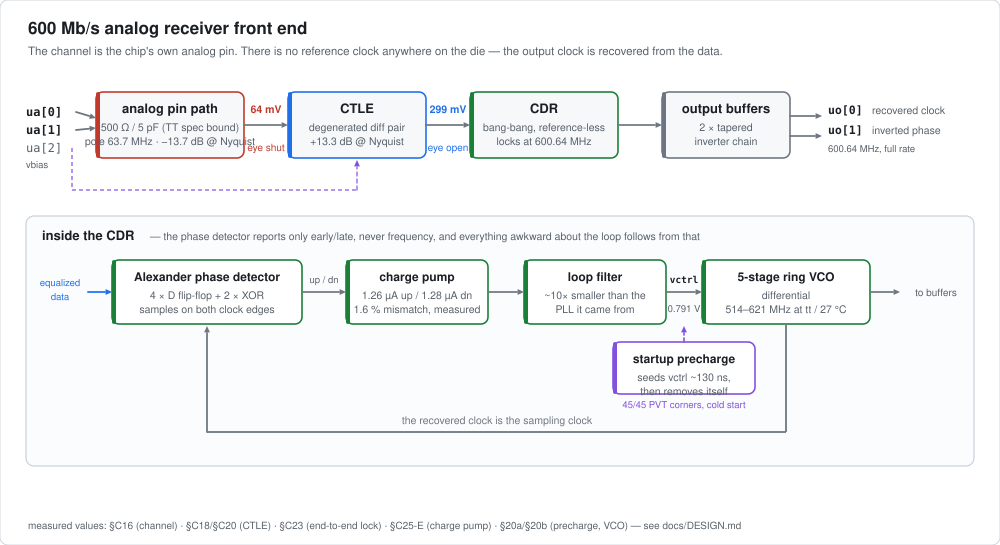
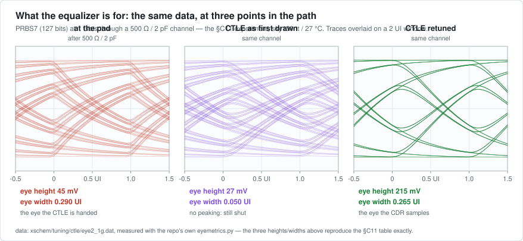
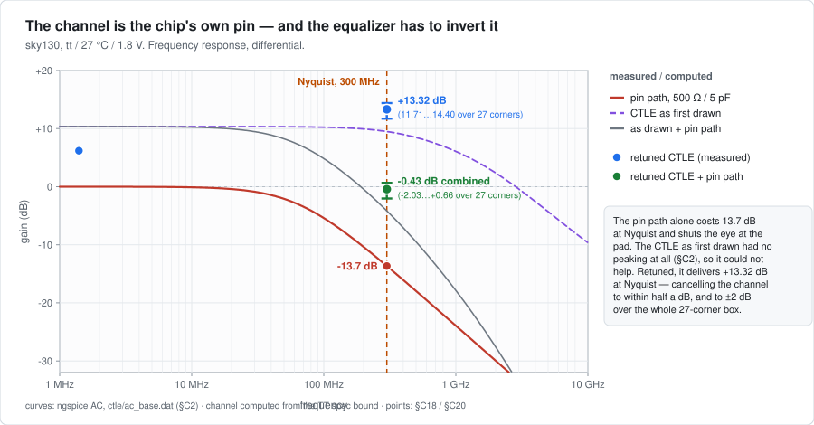
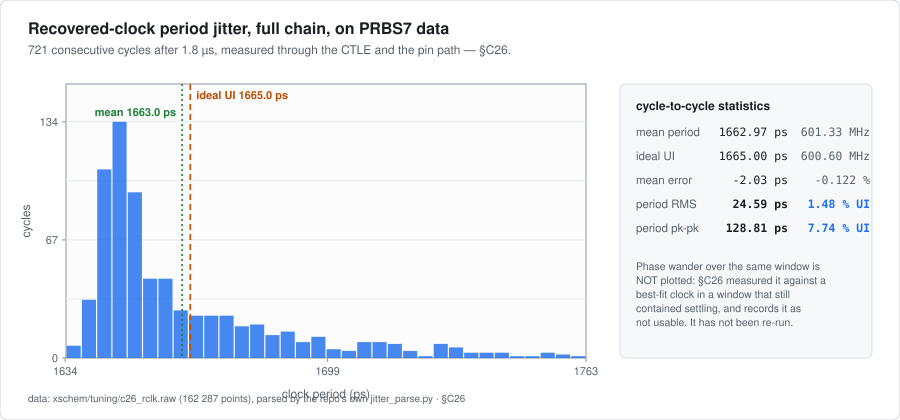

 

# Analog CTLE + Clock Recovery — a 600 Mb/s receiver front end

A fully analog receiver front end for Tiny Tapeout (sky130, custom GDS): a
continuous-time linear equalizer (CTLE) that undoes the loss of the chip's own
analog pin path, feeding a **reference-less bang-bang clock-and-data-recovery
loop** that locks an on-chip ring oscillator to the incoming data. There is no
reference clock anywhere on the die — the output clock is generated from the
data itself, which is why `clock_hz` is 0 and the harness `clk` pin is unused.



- **[Project datasheet](docs/info.md)** — how it works, pinout, how to test on hardware.
- **[Verification methodology](docs/DESIGN.md)** — what was simulated, how, and what each number means.
- **Design logs** — [`xschem/tuning/NOTES.md`](xschem/tuning/NOTES.md) (CDR, §1-§20)
  and [`xschem/tuning/ctle/NOTES_CTLE.md`](xschem/tuning/ctle/NOTES_CTLE.md)
  (CTLE and end-to-end, §C1-§C27). Chronological, including the dead ends.

## Measured results

Every number below comes from a specific simulation recorded in the design
logs, cited in the last column. Nothing here is estimated or extrapolated, and
the two things that were *not* measured say so.

| quantity | value | where it comes from |
|---|---|---|
| Channel: TT analog pin path (spec worst case, 500 Ω / 5 pF) | pole at 63.7 MHz, **−13.7 dB at Nyquist** (300 MHz) | §C16 |
| Eye at the pad before equalization, 200 mVpp in | **fully closed** (−5 mV, 0.000 UI) | §C16 |
| CTLE gain at Nyquist | +11.71 … +14.40 dB over 27 PVT corners (+13.32 dB nominal) | §C18, §C20 |
| CTLE boost (Nyquist gain − DC gain) | +6.30 … +7.90 dB over 27 PVT corners | §C18 |
| Channel + CTLE combined at Nyquist | **−2.03 … +0.66 dB** — flat to ±2 dB over the whole corner box | §C18 |
| Equalized eye, worst corner (ss / 125 °C / 1.62 V) | **174 mV, 0.350 UI** | §C22 |
| Equalized eye, nominal / best corner | 232 mV, 0.430 UI / 273 mV, 0.485 UI | §C22 |
| CTLE output common mode across corners | moves 362 mV (1.149 → 1.511 V) | §C22 |
| End-to-end lock frequency (0101, spec-worst channel) | **600.64 MHz** on 600.6 Mb/s data (+0.006 %) | §C23 |
| Control voltage at lock | 0.791 V end-to-end vs 0.792 V for the CDR alone — the same lock point | §C23, §17e |
| Signal at the CTLE input → output (0101) | 63.7 mV → 299 mV differential (≈ 4.7×) | §C23 |
| PRBS7 acquisition | settles in ~3 µs vs ~1 µs for 0101; overshoots +37 mV, then −26 mV, then −2.7 mV — a damped ring | §C25-B |
| Residual control-voltage ripple | 33.7 mV pp (0101) → 93.8 mV pp (PRBS7) | §C25-A, §C25-B |
| Ripple mechanism | bang-bang quantisation: 1.27 µA × 1.665 ns / 121 fF ≈ 17 mV per update, ~35 mV pp predicted vs 33.7 mV measured | §C25-E |
| Charge-pump up/down match | 1.263 µA up vs 1.284 µA down (1.6 %); both-on leakage 20.6 nA → 2.0 mV per 7-UI run | §C25-E |
| Power-up polarity independence | precharge releases at 126.49 vs 126.56 ns; both polarities converge to 0.799-0.801 V | §C25-C |
| Input sensitivity | 200 mVpp comfortable; **100 mVpp marginal** (path stays linear — 2.00× at the input, 1.92× at the output — but the loop wanders ±40 mV) | §C25-D |
| Cycle-to-cycle jitter, full chain on PRBS7 | **18.45 ps RMS = 1.11 % UI**; 111.5 ps pk-pk = 6.70 % UI, in a proven-settled window | §C27 |
| Cycle-to-cycle jitter, CDR alone on ideal data | 0.68 % UI RMS, 2.5 % UI pk-pk | §16b |
| Sampling-phase error vs the ideal bit grid | 199 ps RMS = **11.96 % UI**, 77 % UI pk-pk. Detrending changes it by 0.1 %, so it is dither, not a residual frequency offset | §C27 |
| Eye remaining at the sampling instant (nominal corner) | mean 181 mV, but **13 of 1201 samples land within 25 mV of the decision threshold** — the clock edge occasionally lands on a data transition | §C27 |
| Startup precharge across PVT | **45/45 corners pass** from a cold supply ramp with no `.ic`: seed 0.693-0.908 V, release 136-167 ns | §20a |
| VCO tuning range (tt / 27 °C) | 514-621 MHz; 6 of 11 swept corners pass, the 5 failures are 125 °C and 1.62 V | §20b |
| Combined-loop PVT | **not measured** — the T2 tier is generated and ready but was never run | `xschem/tuning/HANDOFF.md` §5 |
| Flattened device count (source side of LVS) | 224 devices, 129 nets, 1162 µm² of drawn device area | `mag/LAYOUT_HANDOFF.md` |
| Die area available | 2×2 tiles = 334.88 × 225.76 µm = 75 603 µm² | `mag/LAYOUT_HANDOFF.md` |

### The equalizer is not an optimization — it is what makes the link exist



The same PRBS7 data at three points in the path, measured in ngspice. This is
the §C11 experiment — **1 Gb/s through a 500 Ω / 2 pF channel**, which is the
run whose waveform data was kept; the shipped operating point is 600.6 Mb/s
through 500 Ω / 5 pF, and its eye numbers are the §C22 rows in the table above.
The shape of the result is the same at both: the channel shuts the eye, the CTLE
as originally drawn could not reopen it, and the retuned CTLE does. The three
heights and widths printed on the figure reproduce the §C11 table exactly,
because they are computed by the repository's own `eyemetrics.py`.



Why it was closed in the first place. The Tiny Tapeout analog pin path is
specified at under 500 Ω and under 5 pF, which is a 63.7 MHz pole — **4.7×
below the 300 MHz Nyquist frequency** of 600 Mb/s data — and costs 13.7 dB
there. The CTLE as first drawn had no peaking at all (its degeneration zero
landed on top of its own output pole, §C2), so it could not help. Retuned, it
delivers +13.32 dB at Nyquist, cancelling the channel to within half a dB, and
to ±2 dB across all 27 PVT corners. The ISI is linear, so a linear equalizer
genuinely inverts it: an eye closed by a channel is recoverable in a way that
one closed by noise is not.

### Jitter



Cycle-to-cycle jitter through the whole chain on real data is **1.11 % UI RMS**
(§C27) — about 1.6× the CDR's 0.68 % on ideal full-rail data (§16b), a
reasonable price for a channel that closes the eye at the pad. The histogram
above is the earlier §C26 run, whose window still contained settling; §C27
re-ran it to 6 µs, proved settling inside the deck with three separated
averaging windows, and measures 18.45 ps rather than §C26's 24.59 ps.

**The sampling-phase result is less comfortable, and it is the one worth
reading.** §C27 also dumped the CTLE output alongside the clock, so the eye
actually consumed at the sampling instant could be measured rather than
inferred. Phase error against the ideal bit grid is 11.96 % UI RMS and 77 % UI
peak-to-peak — and detrending it moves the number by 0.1 %, so this is genuine
bang-bang dither, not the residual frequency offset that made §C26's figure
unusable. The mechanism is already in the table: 93.8 mV pp of control-voltage
ripple on a 357 MHz/V oscillator is ±16 MHz of instantaneous frequency.

Against the eye budget that matters: the CTLE delivers 0.350 UI at the worst
PVT corner, so ±0.175 UI of margin, and phase error is 0.120 UI RMS — the eye
edge sits at about 1.46σ. At the nominal corner measured here, 13 of 1201
samples land within 25 mV of the decision threshold.

That number was checked before it was published, because it is unflattering
enough to be worth doubting. The recovered clock available to the measurement
is the *buffered output pin*, not the phase detector's internal sampling clock,
so it could in principle have been sampling at the wrong instant. Sweeping the
sampling phase across a full UI (§C27, `c27_eyescan.py`) shows the output
clock's rising edge already sits at the eye centre — 13 samples below 25 mV
there, against 224 at the crossing — so the figure is measured at the best
sampling phase available, not an arbitrary one. The same sweep turned up
something sharper: the eye is **steeply asymmetric**. Moving 83 ps (0.05 UI) to
one side of the optimum takes near-threshold samples from 13 to 107. The loop is
not dithering about a comfortable centre; it is dithering about a point with a
cliff just to one side of it. That does not say the
design fails — frequency lock is exact to 0.011 % with no cycle slips — but it
does say the margin is thinner than "it locks" implies, and that the residual
ripple is not cosmetic. The run that would decide it is phase error at the
ss / 125 °C / 1.62 V corner, where the eye is 0.350 UI rather than wide open.
That run has not been done.

## What works, what is verified, what is not done

| | |
|---|---|
| **Works** | The full chain is simulated end to end and locks: 200 mVpp differential in through a worst-case model of the TT analog pin path → CTLE → CDR → a recovered 600.64 MHz clock, on an alternating 0101 pattern and on PRBS7, at both data polarities. |
| **Verified** | ngspice: AC across 27 PVT corners, PRBS7 eye diagrams at the corner extremes, 45-corner PVT on the startup cell from a cold supply ramp, an 11-corner VCO tuning-range sweep, and four 3 µs full-chain transients (pattern, polarity, amplitude). Netlist-level: the promoted schematics were compared subcircuit-by-subcircuit against the validated sandbox — all 17 leaf subcircuits matched exactly. |
| **Scope line: layout** | The schematic design is **frozen and netlist-verified**, and the physical flow is wired up and proven to run before any polygon is drawn: `make lvs` in `mag/` reads `src/project.v` and the xschem netlist and today correctly reports 0 devices on the layout side against 224 on the source side. The device inventory is measured per block (1162 µm² drawn against 75 603 µm² available, so area is not the constraint), the floorplan guidance is written up in `mag/LAYOUT_HANDOFF.md` and `mag/MAGIC_GUIDE.md`, and one leaf cell (`mag/d_latch.mag`) is drawn as a pathfinder. **The macro itself has not been drawn.** |
| **Also not done** | PVT on the *combined* loop (tier T2 is generated, never run). Sampling-phase jitter is now measured at the nominal corner (§C27) and the answer is not comfortable — 0.120 UI RMS against ±0.175 UI of worst-corner margin — so the corner run is the open question that decides the design. |
| **Known limitation** | The ring oscillator cannot reach 600 MHz at 125 °C or at a 1.62 V supply. It is characterised (above ~0.85 V the ring is RC-limited by its load resistor, not current-starved, so more control voltage buys nothing), understood, and **accepted** rather than fixed — §20b. |

Because there is no GDS yet, the Tiny Tapeout `gds` workflow is gated on the
existence of `gds/` and skips itself instead of failing, and there is
deliberately no GDS badge above until there is something real behind it.

## How it was verified

The short version: **cheap checks first, and every pass criterion written in
code rather than judged by eye.** AC before transient, block before loop,
open-loop VCO reach before closed-loop acquisition; a three-tier PVT harness
that generates its decks from the schematics, runs them strictly sequentially
under a memory/wall-clock guard, and collects them with explicit pass/fail
rules; and a netlist-level equivalence check when the validated sandbox was
promoted into the real schematics.

**[docs/DESIGN.md](docs/DESIGN.md)** lays that out as a table — the question
each stage had to answer, the deck that answered it, the result, and the log
section — followed by the measurement traps that produced wrong-but-plausible
numbers, and an explicit list of what is *not* verified.

## Four things that went wrong, and how they were caught

The design logs keep negative results on purpose. These are the four that
mattered most.

1. **A 2× error in the frequency plan cost three sessions.** The target had
   been written down as 300 MHz — which is the *square-wave* rate of alternating
   data, not the baud rate. The design is 600 Mb/s, UI 1.665 ns. Everything
   downstream had been tuned against a number that was wrong by a factor of two,
   and the loop started locking as soon as it was corrected. (§14)
2. **Half of all power-ups never acquired lock, and it depended on the data
   polarity at power-on.** A bang-bang detector is phase-only, so the loop has no
   way back if the control voltage starts below the oscillator's dead-zone cliff.
   The fix is a startup cell that seeds the control voltage for ~130 ns and then
   electrically removes itself (~1 fA afterwards). Its bias is a scaled replica
   of the ring's own tail device, so the seed tracks the cliff over process,
   voltage and temperature instead of being a hard-coded voltage — which is why
   all 45 corners pass. (§16g/h → §17, §20a)
3. **A mechanism written down from the schematic was wrong by 80×.** The residual
   control-voltage ripple on PRBS7 was attributed to charge-pump up/down mismatch
   integrating over runs of identical bits, complete with an order-of-magnitude
   estimate. Measuring the pump directly refuted it: the mismatch is 20.6 nA, not
   the ~1.7 µA predicted, and accounts for 1.2 % of the effect. The real cause is
   ordinary bang-bang quantisation — 1.27 µA × 1.665 ns / 121 fF ≈ 17 mV per
   update, so ~35 mV pk-pk expected against 33.7 mV measured. Reading a schematic
   tells you which effects exist, never how big they are. (§C25-E)
4. **A conclusion of my own was premature and had to be withdrawn.** A 2 µs
   PRBS7 run showed the control voltage still moving and was recorded as "does
   not settle". Running the same trajectory to 3 µs showed it had been caught at
   the peak of an overshoot: +37 mV, −26 mV, −2.7 mV — a damped ring, not a
   runaway. The earlier section is kept in the log with the correction attached
   rather than edited away. (§C24 → §C25-B)

## Repository layout

| path | what |
|---|---|
| `xschem/ctle_cdr_rx.sch` | **the analog macro that gets laid out** — CTLE → CDR → output buffers |
| `xschem/ctle_cdr_rx_lvs.sch` | one-instance wrapper; netlisting this is what emits a `.subckt` for netgen |
| `xschem/CTLE.sch`, `xschem/CDR.sch` | the two main blocks, and the 20 cells below them |
| `xschem/STATUS.md` | state of the real design files, and the 2026-08-15 promotion |
| `xschem/attic/` | retired testbenches and exploration schematics, kept because the logs cite them |
| `xschem/tuning/` | the simulation sandbox: testbenches, decks and the PVT harness |
| `xschem/tuning/NOTES.md` | the CDR design log, §1-§20 |
| `xschem/tuning/ctle/NOTES_CTLE.md` | the CTLE and end-to-end design log, §C1-§C27 |
| `xschem/tuning/HANDOFF.md` | current state and open items |
| `xschem/tuning/c25_summary.txt` | raw `meas` output of the four 3 µs end-to-end runs |
| `docs/DESIGN.md` | verification methodology — start here to understand *how* it was checked |
| `docs/SIMULATION_TRAPS.md` | the silent-failure traps in sky130 + ngspice that cost real time here |
| `docs/img/` | the figures above |
| `docs/tools/` | the pure-stdlib SVG generators that build them from the simulation data |
| `src/project.v` | blackbox Verilog: the pad ↔ macro wiring that LVS checks |
| `model/` | real-number behavioural model of the receiver + a self-checking testbench |
| `mag/` | Magic layout: `make lvs` / `make drc` / `make update_gds`, plus `LAYOUT_HANDOFF.md` |
| `test/` | repository-consistency and analysis-tool tests (pytest, no PDK or simulator needed) |

## A behavioural model you can actually simulate

The macro is custom analog, so the only synthesisable Verilog in the project is
the blackbox wrapper in `src/project.v`. That is correct for tapeout and
useless for system work — a SPICE deck cannot go into a link simulation, and a
transient of this chain costs 7-20 minutes.

[`model/rx_cdr_rnm.sv`](model/rx_cdr_rnm.sv) is the same receiver as a
discrete-time real-number model: pad channel, CTLE zero/pole, Alexander phase
detector, charge pump, loop filter and ring oscillator, stepped at 10 ps. It
runs in seconds, and [`model/tb_rx_cdr.sv`](model/tb_rx_cdr.sv) closes the loop
on PRBS7 and checks itself.

Every constant is measured and cites its log section. The two exceptions — the
loop-filter R and C — are labelled `FITTED, NOT MEASURED` in the source,
because they are chosen to reproduce §C25-B's ripple rather than read off the
schematic.

| the model, on PRBS7 at 600.6 Mb/s | |
|---|---|
| recovered clock | 600.59 MHz against a 600.60 Mb/s data rate |
| control voltage at lock | **0.7994 V**, against the ~0.80 V §C26 measured in SPICE |
| bit errors, settled window | 0 over 900 bits |

The control-voltage agreement is the interesting one: nothing in the model is
fitted to it. It falls out of the measured 357 MHz/V oscillator slope and the
§C25-E charge-pump currents, so the RNM and the SPICE netlist agreeing on where
the loop parks is a genuine cross-check rather than a tuned result.
`test/test_rnm_model.py` pins all three numbers in CI.

**What it is not:** the ring is a phase accumulator with no phase noise, so the
model *understates* jitter and is never the source of a jitter number — those
come from SPICE. It has no noise, no mismatch and no PVT. The limits are listed
at the top of the source file, and a test asserts they stay there.

The model's own first version was a good illustration of why it needed a
testbench: the phase detector was written combinationally, and since the data
and edge samples update half a UI apart, it spent half of every UI comparing
the new edge sample against the old data pair. The control voltage walked into
the supply rail. It compiled, simulated and produced a waveform the whole time.
An Alexander detector has to make one registered decision per UI.

## Tests

```console
$ pip install -r test/requirements.txt
$ pytest test/
```

No PDK, no ngspice, no magic, no network; the whole suite runs in well under a
second on every push. It covers three things:

- **consistency** — `info.yaml`, `src/project.v` and the magic top cell still
  agree on the module name, tile size and pin mapping;
- **structure** — every symbol in the frozen xschem hierarchy still resolves and
  the expected blocks are still instantiated. This one earns its place: xschem
  resolves a missing symbol *silently* and emits a truncated netlist, which is
  the netlist LVS then trusts;
- **the measuring instruments** — the analysis scripts that produced the numbers
  in the table above (`eyemetrics.py`, `jitter_parse.py`, `collect_pvt.py`) are
  run against synthetic fixtures whose answer is known analytically, so an eye
  metric or a PVT pass criterion cannot quietly change meaning.

See [`test/README.md`](test/README.md).

## Running the simulations

Simulations on the development VM must go through
`xschem/tuning/safe_ngspice.sh`, which caps memory and wall-clock time and
watches `/proc/meminfo`. That is not a style preference — an unguarded ngspice
has already OOM-crashed this machine once. See `CLAUDE.md` for the full rules
and for the tool traps (xschem, ngspice and sky130 corner handling) that cost
real time on this project.

The figures in `docs/img/` are regenerated from data already on disk with
`python3 docs/tools/make_figures.py`; no simulation is re-run to build them.

## What is Tiny Tapeout?

Tiny Tapeout is an educational project that aims to make it easier and cheaper than ever to get your designs manufactured on a real chip.

To learn more and get started, visit https://tinytapeout.com.

## Analog projects

For specifications and instructions, see the [analog specs page](https://tinytapeout.com/specs/analog/).

## Resources

- [FAQ](https://tinytapeout.com/faq/)
- [Digital design lessons](https://tinytapeout.com/digital_design/)
- [Learn how semiconductors work](https://tinytapeout.com/siliwiz/)
- [Join the community](https://tinytapeout.com/discord)
